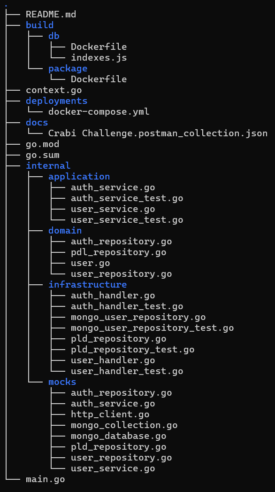

# crabi-challenge

This repository implements a User Management Service written in Go, with the following features:

## Features
- **Docker Multistage Build:** Utilizes a multistage Docker build process to separate the building and deployment stages, ensuring a cleaner and more efficient image.
- **Distroless Docker Image:** Leverages a distroless Docker image for enhanced performance and smaller image size, reducing the attack surface and improving security.
- **MongoDB with Docker:** MongoDB is used as the database and is containerized using Docker, allowing for easy setup and portability across different environments.
- **Simplified Hexagonal Architecture:** Implements a simplified version of the Hexagonal Architecture (also known as Ports and Adapters), promoting a clear separation of concerns and better maintainability of the codebase.
- **JWT Authentication System:** Includes a secure and scalable authentication system using JSON Web Tokens (JWT) for user authentication and session management. JWT is integrated with the Echo framework, enabling efficient and easy-to-use API handling.
- **Comprehensive Unit Testing Coverage:** Provides extensive unit testing coverage to ensure code reliability and quality, helping maintain a stable and bug-free application. Testify is used for writing the unit tests, ensuring easy assertion and mock handling.
- **Automatic Mocks with Mockery:** Mocks for unit tests are automatically generated using Mockery, making it easy to test components with external dependencies, ensuring test isolation and accuracy.

## Install

Set the environment variables in the `docker-compose.yml` file located in the `deployments` folder as shown below:

```
MONGODB_URL: mongodb://username:password@db:27017/
HTTP_PORT: 8080
JWT_KEY: secret
PLD_URL: http://98.81.235.22
```

Make sure Docker is installed and running, then execute the following command:

```
docker-compose -f deployments/docker-compose.yml --project-directory . up
```

## Routes

You can find the **Postman collection** for testing and interacting with the API in the `docs` folder of this repository.

### 1. Create User
- **Endpoint**: `POST /signin`
- This endpoint allows for user registration.
- It queries an external **PLD (Politically Exposed Person List)** service to check if the user is listed in a blacklist.
- If the user is found in the blacklist, an error is returned, and the user cannot be created.

#### Example request
```
{
    "email": "an@email.com",
    "password": "password",
    "first_name": "Firstname",
    "last_name": "Lastname"
}
```
#### Expected Response
Empty body with a 201 status.

### 2. Login
- **Endpoint**: `POST /login`
- This endpoint allows users to authenticate using their **email** and **password**.
- Upon successful authentication, the service returns a **JWT (JSON Web Token)** token for further interactions.

#### Example request
```
{
    "email": "an@email.com",
    "password": "password"
}
```
#### Expected Response
```
{
    "token": "eyJhbGciOiJIUzI1NiIsInR5cCI6IkpXVCJ9..."
}
```

### 3. Get User Information
- **Endpoint**: `GET /user`
- This endpoint allows users to retrieve their own information (self-query).
- It ensures that users can securely access their own details after authentication.

#### Example request
Authorization header with 'Bearer eyJhbGciOiJIUzI1NiIsInR5cCI6IkpXVCJ9...' token
#### Expected Response
```
{
    "id": "67b2cda29c1f24e3740d128c",
    "email": "an@email.com",
    "password": "password",
    "first_name": "Firstname",
    "last_name": "Lastname",
    "created_at": "2025-02-17T05:48:18.821Z",
    "updated_at": "2025-02-17T05:48:18.821Z"
}
```

## Folder structure
